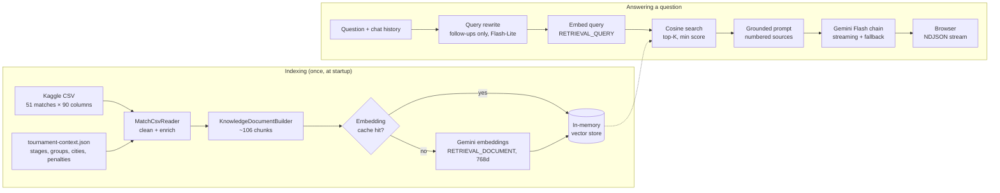

# ⚽ Euro 2024 RAG

A ChatGPT-style assistant that answers questions about **UEFA Euro 2024** using **Retrieval-Augmented Generation**.
Built with **.NET 10**, **Microsoft.Extensions.AI**, **Google Gemini** (chat + embeddings), the **.NET Community Toolkit in-memory vector store**, **Polly** and a small **jQuery** front end.

> Ask *"Who won Euro 2024 and how did they get there?"*, *"Türkiye turnuvada nasıl bir performans gösterdi?"* or *"Which team over-performed its xG the most?"*. The app retrieves the relevant documents, shows them with similarity scores, and streams an answer that cites them.

## Features

- **End-to-end RAG pipeline**: CSV → documents → embeddings → vector store → retrieval → grounded, streamed generation.
- **Chunking designed around the questions people ask**: match reports, plus pre-computed team summaries, group tables, venues and leaderboards, so aggregate questions work as well as single-match ones.
- **Query rewriting for follow-ups**: "and what about their defence?" becomes a standalone English search query, generated by a cheap Flash-Lite model.
- **Asymmetric Gemini embeddings** (`RETRIEVAL_DOCUMENT` vs `RETRIEVAL_QUERY`), truncated to 768 dimensions.
- **Citations**: every answer cites its sources as `[n]`; click a citation to open the source and see its similarity score.
- **Model fallback chain with Polly**: `gemini-3.8-flash` → `gemini-3.5-flash` → `gemini-3.7-flash` → `gemini-3.6-flash`, with retries, timeouts, daily-quota detection and a streaming-aware fallback.
- **Embedding cache on disk**: restarts don't re-embed unchanged documents.
- **Provider-agnostic core**: the RAG code only depends on `IChatClient`, `IEmbeddingGenerator` and `VectorStoreCollection`, so Gemini or the vector store can be swapped without touching it.
- [ ]  Architecture



## How the RAG pipeline works

### 1. Ingestion and chunking

Vector search returns the *K most similar* chunks. That is great for *"What happened in Spain vs Germany?"* (one match chunk answers it), but it cannot sum 51 rows to answer *"Which team scored the most goals?"*. So the aggregations are computed in C# during ingestion and stored as their own chunks:


| Kind          | Count | Example question it answers                  |
| ------------- | ----- | -------------------------------------------- |
| `match`       | 51    | "Compare the stats of the final."            |
| `team`        | 24    | "How did Turkiye do?"                        |
| `group`       | 6     | "Show me the Group F table."                 |
| `venue`       | 10    | "Which matches were played in Berlin?"       |
| `leaderboard` | 13    | "Which team received the most yellow cards?" |
| `tournament`  | 2     | "Which matches ended 0–0?"                  |

Each chunk is written in natural language, with a descriptive first sentence ("UEFA Euro 2024 match report — Match 51 of 51: Spain vs England (Final)"), because that sentence largely decides what the embedding "means".

### 2. Embeddings

- Model: `gemini-embedding-001`, truncated to **768 dimensions** (Matryoshka representation), which is plenty for ~100 chunks.
- Documents are embedded with task type `RETRIEVAL_DOCUMENT` and questions with `RETRIEVAL_QUERY`. Microsoft.Extensions.AI has no task-type concept, so it is passed through `EmbeddingGenerationOptions.RawRepresentationFactory` (see `GeminiEmbeddingOptions`).
- Embeddings are cached in `App_Data/embedding-cache.json`, keyed by `sha256(model | dimensions | text)`. Changing a chunk's text re-embeds only that chunk.

### 3. Retrieval

- Store: `CommunityToolkit.VectorData.InMemory`, behind the `Microsoft.Extensions.VectorData` abstractions.
- Similarity: cosine, top **8**, results below **0.5** are dropped (`Rag:TopK`, `Rag:MinScore`).
- **Query rewriting** (`Rag:QueryRewrite` = `FollowUps` by default): a follow-up is rewritten into a standalone English query using the conversation. After a question about Turkiye, *"Peki elendikleri maçta rakibe göre xG'leri nasıldı?"* becomes *"Turkiye vs Netherlands quarter final match xG stats Euro 2024"*. A first question is searched as-is: Gemini embeddings are multilingual, so the Turkish *"Türkiye turnuvada nasıl bir performans gösterdi?"* already retrieves the Turkiye team summary, all five Turkiye matches and the Group F table. Rewriting runs on its own Flash-Lite chain (`Gemini:RewriteModels`), which is faster and, on the free tier, uses its own quota. If the rewrite fails, the raw question is used.
- `GET /api/search?q=...` returns the raw retrieval results, which helps when tuning chunking.

### 4. Generation

The model gets a system prompt that restricts it to the numbered sources, asks for `[n]` citations and tells it to answer in the user's language. The answer is streamed to the browser as NDJSON:

```
{"type":"query","text":"Spain path to the title Euro 2024 champions"}
{"type":"sources","data":[{"index":1,"id":"team-spain","kind":"team","score":0.81,...}]}
{"type":"delta","text":"Spain won the tournament"}
...
{"type":"done","data":{"model":"gemini-3.8-flash","elapsedMs":2140,"inputTokens":3120,"outputTokens":210}}
```

If the stream breaks after text has been sent, the answer is regenerated once: the server sends `{"type":"reset"}` and the browser discards the partial text.

## Resilience: model fallback chain with Polly

The Gemini .NET SDK only retries HTTP calls on the same model; it has no model fallback. `ResilientChatClient` adds one with Polly v8 while still being a plain `IChatClient`. It takes an ordered list of models and builds one pipeline per model, whose Fallback strategy hands over to the next one:

```
gemini-3.8-flash:  Fallback (→ next model) └─ Retry (2×, exponential + jitter) └─ Timeout (15 s)
gemini-3.5-flash:  Fallback (→ next model) └─ Retry └─ Timeout
gemini-3.7-flash:  Fallback (→ next model) └─ Retry └─ Timeout
gemini-3.6-flash:                           Retry └─ Timeout     ← last model, errors surface to the UI
```


| Failure                                                          | Retry same model                   | Fall back                    |
| ---------------------------------------------------------------- | ---------------------------------- | ---------------------------- |
| 429 per-minute rate limit, 5xx, timeout, network, stream cut off | ✅                                 | ✅ after retries             |
| 429**daily** quota exhausted (`…PerDay…` quota id)             | ❌ won't recover until midnight PT | ✅ immediately               |
| 404 unknown or retired model id                                  | ❌                                 | ✅ immediately               |
| 400 / 401 / 403 bad request or API key                           | ❌                                 | ❌ (would fail on any model) |

**Streaming** can only fall back before the user sees any text. The pipeline wraps "open the stream and read until the first *visible* content"; thinking models can send empty or reasoning-only chunks first, and those are buffered rather than counted as a successful start. If a stream breaks after visible text, `RagService` regenerates the answer once and tells the browser to reset.

**Embeddings are retried but never fall back**: a different embedding model produces vectors in a different space that can't be compared with the index. Free-tier embedding quotas are per minute, so a 429 waits 15 → 60 s instead of a few seconds, and the embedding cache is saved after every batch so an interrupted indexing run resumes where it stopped.

### Free tier notes

On the Gemini API free tier, quotas are **per project and per model** (for example `gemini-3.8-flash` allowed 20 requests per day when this was built), and daily quotas reset at midnight Pacific time. That is why the chain has several models, and why query rewriting is limited to follow-ups and runs on separate Flash-Lite models. Check your limits in [AI Studio](https://aistudio.google.com/rate-limit). Popular models can also return 503 "high demand" for a while; the chain handles this, but answers are slower when it does.

## The dataset

[Euro 2024 Matches](https://www.kaggle.com/datasets/thamersekhri/euro-2024-matches) by Thamer Sekhri, licensed under [CC BY-SA 4.0](https://creativecommons.org/licenses/by-sa/4.0/): one row per match (51) with ~45 team statistics per side (xG, shots, passes, duels, cards…). It has **no player names, goal scorers, minutes or dates**, and the assistant says so when asked.

Data quality issues found and handled in `MatchCsvReader`:

- Stadium names lost their non-ASCII characters (`Fuball Arena Mnchen`); they are mapped back to the real names and host cities.
- Several stats appear twice under slightly different headers (`Total shots` / `Total shots.`); the first one is used.
- `Accurate passes` is copied from other rows (e.g. Hungary: 438 passes, 643 accurate), so it is ignored.
- There is no stage or group column. Rows are chronological, so stage is derived from the row number.

`Data/tournament-context.json` adds a small set of facts the CSV lacks: stage boundaries, groups, host cities and which knockout matches went to extra time or penalties. Without it, *"Who won Portugal vs France?"* would only show a 0–0 draw.

## Getting started

**Prerequisites:** [.NET 10 SDK](https://dotnet.microsoft.com/download) and a Gemini API key from [Google AI Studio](https://aistudio.google.com/apikey).

1. Add your key. The key goes in `appsettings.Development.json`, which is git-ignored:

   ```bash
   cp src/Euro2024Rag.Web/appsettings.Development.example.json src/Euro2024Rag.Web/appsettings.Development.json
   ```

   Then replace the placeholder with your key. You can use an environment variable instead (`Gemini__ApiKey=...`).
2. Run the app:

   ```bash
   dotnet run --project src/Euro2024Rag.Web
   ```
3. Open http://localhost:5231. The first start embeds ~106 chunks (a few seconds); later starts load them from the cache.

## Configuration

All settings are in `appsettings.json`:


| Key                                  | Default                                                                        | Description                                               |
| ------------------------------------ | ------------------------------------------------------------------------------ | --------------------------------------------------------- |
| `Gemini:ChatModels`                  | `gemini-3.8-flash`, `gemini-3.5-flash`, `gemini-3.7-flash`, `gemini-3.6-flash` | Answer models in fallback order                           |
| `Gemini:RewriteModels`               | `gemini-3.5-flash-lite`, `gemini-3.1-flash-lite`                               | Query rewrite models in fallback order                    |
| `Gemini:EmbeddingModel`              | `gemini-embedding-001`                                                         | Embedding model (768 dimensions)                          |
| `Gemini:Resilience:MaxRetryAttempts` | `2`                                                                            | Retries per model for transient errors                    |
| `Gemini:Resilience:AttemptTimeout`   | `00:00:15`                                                                     | Per attempt; for streaming, time to first visible content |
| `Rag:TopK`                           | `8`                                                                            | Chunks retrieved per question                             |
| `Rag:MinScore`                       | `0.5`                                                                          | Minimum cosine similarity                                 |
| `Rag:QueryRewrite`                   | `FollowUps`                                                                    | `Off`, `FollowUps` or `Always`                            |
| `Rag:MaxHistoryMessages`             | `6`                                                                            | Previous messages sent to the model                       |

## API


| Endpoint                      | Description                                                               |
| ----------------------------- | ------------------------------------------------------------------------- |
| `GET /api/status`             | Indexing progress, chunk counts, configured models                        |
| `GET /api/search?q=...&top=8` | Retrieval only: the chunks and scores the model would see                 |
| `POST /api/chat`              | `{ "messages": [{ "role": "user", "content": "..." }] }` → NDJSON stream |

## Project structure

```
src/Euro2024Rag.Web
├── Configuration/      GeminiOptions, RagOptions, ResilienceOptions
├── Data/               Kaggle CSV + tournament-context.json
├── Ingestion/          CSV reader, domain model, chunk builder, embedding cache, startup indexing
├── Rag/                KnowledgeChunk (vector record), RagService (rewrite → retrieve → generate)
├── Resilience/         ResilientChatClient (Polly fallback), RetryingEmbeddingGenerator
├── wwwroot/            jQuery chat UI
└── Program.cs          DI wiring + minimal API endpoints
```